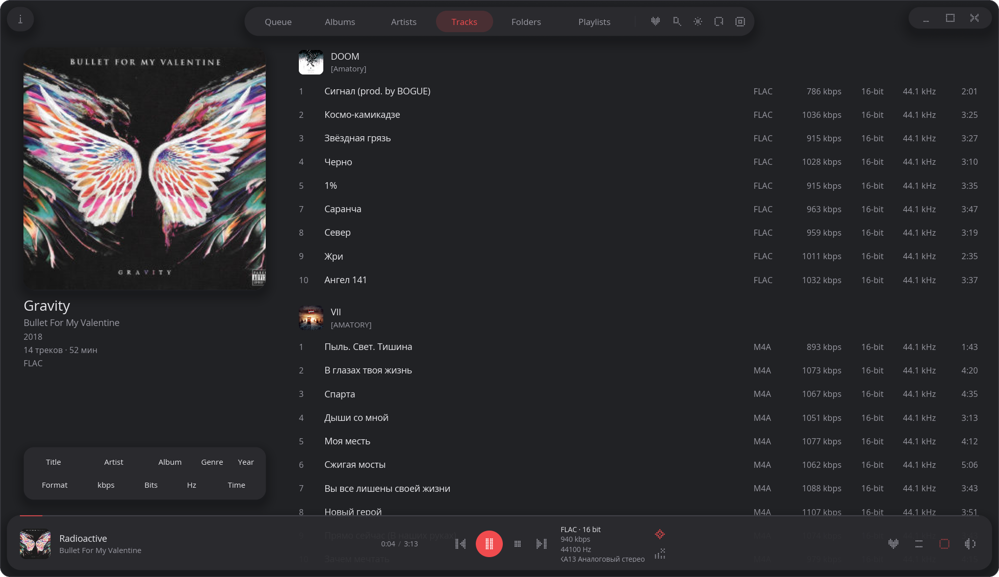
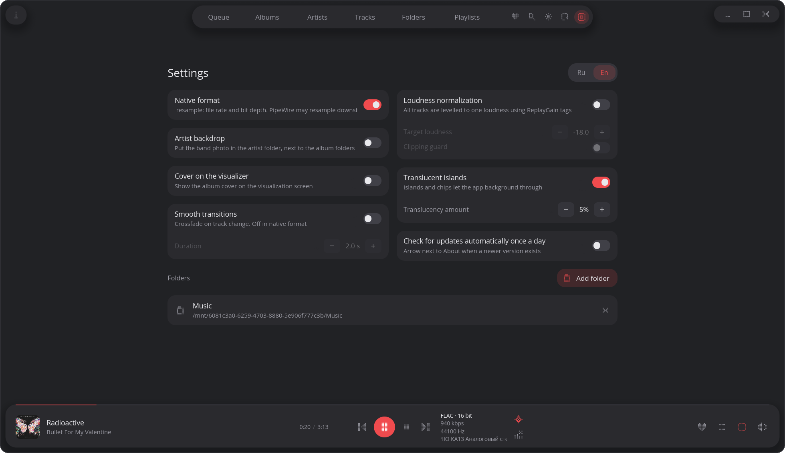
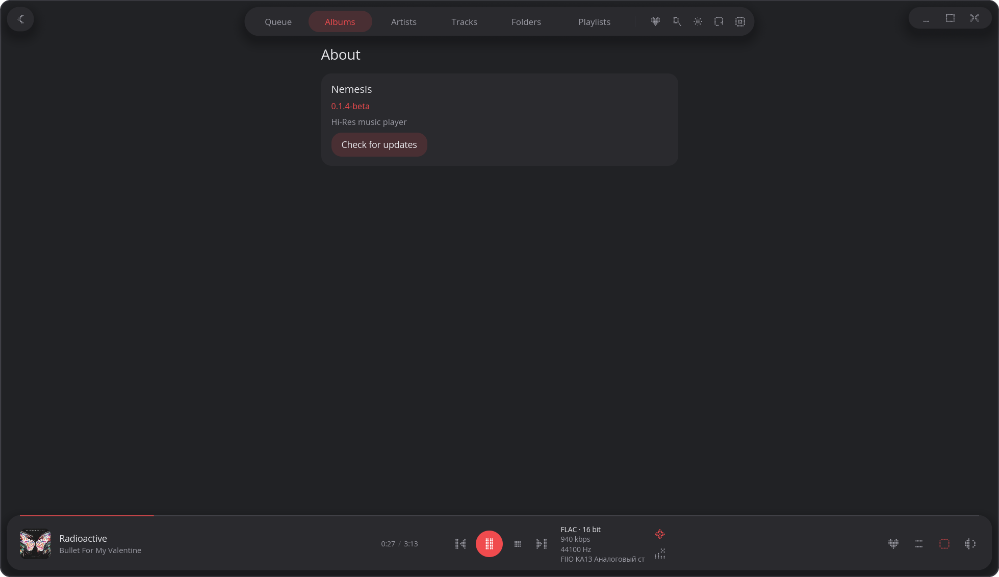
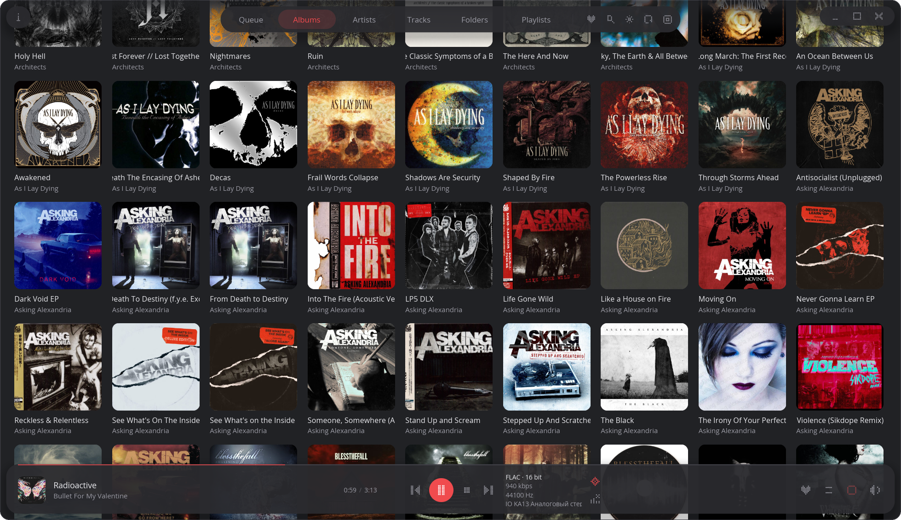
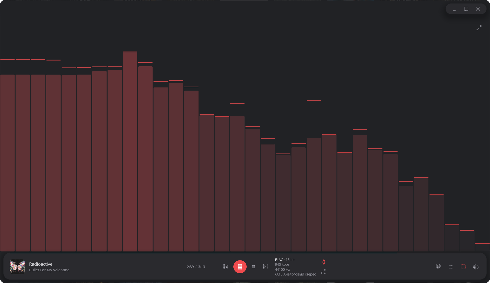
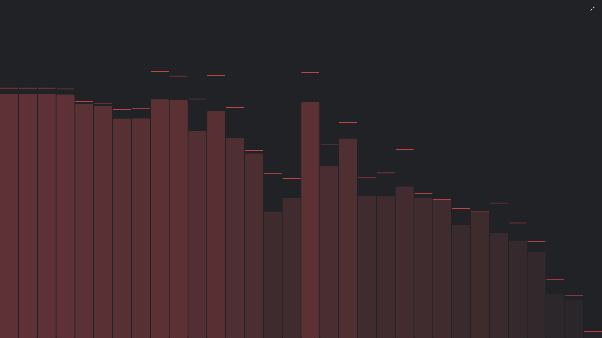

# Nemesis

Локальный музыкальный плеер. Нативный UI на [iced](https://iced.rs/), без браузера внутри. Версия **0.1.1-beta** (Free): скачал, указал папку, слушает. Поиск и плейлисты в интерфейсе ещё не выведены. macOS нет.

English: [README.md](README.md)

Релизы: [github.com/aevahonin/Nemesis/releases](https://github.com/aevahonin/Nemesis/releases)

---

## Что умеет

Библиотека с диска (mp3, flac, wav, ogg, opus, m4a, aac), вкладки очередь / альбомы / исполнители / треки / папки, очередь, shuffle, repeat, кроссфейд, seek, спектр, обложки. Окно без системной рамки, тёмная и светлая тема, Ru/En.

**Нативный формат:** приложение отдаёт частоту и битность файла, само не ресемплит. PipeWire или shared WASAPI дальше могут ресемплить сами. Exclusive / DSD / PEQ — не этот релиз.

Данные: Linux `~/.nemesis/`, Windows `%USERPROFILE%\.nemesis\` (библиотека, кэш обложек, окно, настройки).

<p align="center">
  
</p>

<p align="center">
  
  
  
  
  
  
</p>


---

## Linux и Windows

Smoke на Windows x86_64 (2026-09-03): окно, скан, play/next/stop, SMTC, тема, нативный формат — ок.

| | Linux (x86_64) | Windows 10/11 (x86_64) |
|---|---|---|
| Скан, очередь, shuffle, repeat, кроссфейд | да | да |
| Нативный формат PCM | да | да |
| Громкость в нативном формате | `pactl` (sink-input) | том WASAPI-сессии процесса |
| Медиаклавиши без фокуса | MPRIS (`nemesis` на D-Bus) | SMTC |
| Тема / акцент ОС | портал, GNOME, KDE | реестр |
| Окно без рамки, прозрачность | да | да |
| Постановка | `.deb` / `.rpm` / `.pkg.tar.zst` / tar.gz | **portable zip**, без установщика |

---

## Установка

Бери артефакт **x86_64**, если это обычный PC. Имя файла смотри в релизе (тег как в Cargo: `v0.1.1-beta`).

### Debian / Ubuntu (12+ / 22.04+)

```bash
sudo dpkg -i nemesis_*_amd64.deb
sudo apt-get install -f   # если ругнётся на зависимости
```

Нужны PipeWire или PulseAudio, драйвер GPU (Vulkan/OpenGL).

### Fedora (39+)

```bash
sudo dnf install nemesis-*.x86_64.rpm
```

### Arch / Manjaro / EndeavourOS

```bash
sudo pacman -U nemesis-*-x86_64.pkg.tar.zst
```

AUR пока нет.

### Linux без пакета

Распаковать `nemesis-*-linux-x86_64.tar.gz` от корня `/` (внутри `usr/bin/nemesis` и `.desktop`). Либо запустить бинарь из `usr/bin/` с рабочей библиотекой системы той же glibc.

### Windows

Распаковать `nemesis-*-windows-x86_64-portable.zip`, запустить `nemesis.exe`. Отдельные DLL не нужны. В меню Пуск сам не прописывается.

---

## Что поддерживается

| Сборка | Статус |
|---|---|
| Linux x86_64, glibc ≥ 2.36 (Debian 12, Ubuntu 22.04, Fedora 39+, актуальный Arch) | основной путь |
| Windows 10/11 x86_64 | основной путь, portable |
| Linux aarch64, Windows ARM64 | **экспериментально** |

Экспериментальные сборки **нигде не гонялись**: пакет может не встать, окно и звук могут не подняться. Для повседневного использования — только x86_64.

Ещё не тестировали (и это полезно прислать, если прогнал):

- другая DE / композитор, не GNOME/KDE
- HiDPI, несколько мониторов, snap окон на Windows
- наушники с железячными кнопками, SMTC/MPRIS из шторки
- большой каталог, CUE, редкие теги
- нативный формат 24-bit / 96 kHz на конкретной карте
- Windows ARM / Linux ARM, если решишься

---

## Стек

Rust, [iced](https://iced.rs/) 0.14, wgpu, rodio/cpal, Symphonia, Lofty, rusqlite (SQLite внутри бинаря), rfd (пикер папок). Звук: ALSA → PipeWire/Pulse на Linux, WASAPI на Windows.

---

## Обратная связь

[Issues](https://github.com/aevahonin/Nemesis/issues) в этом репозитории.

В issue укажи:

1. ОС и версия (например Arch, Ubuntu 24.04, Windows 11 23H2), окружение (GNOME / KDE / другое).
2. Архитектура: x86_64 или ARM.
3. Точное имя файла из релиза (`nemesis_…deb`, zip, …).
4. Версия в «О приложении».
5. Что делал, что ожидал, что вышло. Скрин, если про UI.
6. Нативный формат вкл/выкл, формат проблемного файла (flac 16/44.1 и т.д.).

Windows release без консоли — лога в окне cmd нет. На Linux, если запускал из терминала, вставь вывод.

Не прикладывай всю библиотеку и `library.db`. Достаточно одного файла, на котором ломается (если можно), и шагов.
